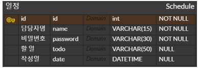

# [Spring 3기] Ch 3. 일정 관리 서버 만들기


## 📁 과제 소개 및 목표

Spring 강의를 듣고 구현하고자 하는 서비스의 전체적인 흐름을 파악하고 필요한 기능을 설계할 수 있다.
API 명세서, ERD, SQL 데이터 베이스를 작성할 수 있다.
Spring Boot를 기반으로 CRUD 기능이 포함된 REST API를 만들 수 있다.


## 🌏 개발 환경

- Java (JDK) 17.0.12
- IDE: IntelliJ IDEA Ultimate
- Spring Boot: 3.3.4
    - Dependencies
        - Spring Web
        - Thymeleaf
        - Lombok
        - MySQL driver
        - JDBC API


## ⏲ 개발 기간

2024.09.26 ~ 2024.10.04

### Task Process

|        Date         | Progress                        |
|:-------------------:|---------------------------------|
| 24.09.26 ~ 24.10.01 | 과제 발제 이후 개인 과제 요구 사항 이해<br>Spring 강의 수강 |
| 24.10.02 ~ 24.10.04 | 코드 작성, README 작성, 트러블 슈팅        |
|     24.10.04 ~      | 과제 제출                           |

## 📋 목차

- 1️⃣ 기획편 - 요구 사항 정의 및 설계

- 2️⃣ 개발편 - 단계별 필수 기능 구현을 위한 코딩

- 3️⃣ 고찰 및 회고 편 - 힘들거나 어려웠던 부분 및 소감

<br>

### 1️⃣ 기획편
#### 요구사항 숙지
**Lv 2. 일정 생성 및 조회**

1. 일정 생성(일정 작성하기)
    - 할일, 작성자명, 비밀번호, 작성/수정일 저장
    - 작성/수정일은 날짜와 시간을 모두 포함한 상태
    - 각 일정의 고유 식별자(id)를 자동으로 생성하여 관리
    - 최초 입력 시 수정일은 작성일과 동일
2. 전체 일정 조회(등록된 일정 불러오기)
    - 수정일: YYYY-MM-DD
    - 작성자명
    - 위 두 조건 중 한 가지만을 충족하거나, 둘 다 충족하지 않거나, 둘 다 충족할 수도 있음
    - 수정일 기준 내림차순으로 정렬하여 조회
3. 선택 일정 조회(선택한 일정 정보 불러오기)
    - 단건 정보 조회
    - 고유 식별자(id)를 사용하여 조회

**Lv 3. 일정 수정 및 삭제**

1. 선택한 일정 수정
    - 일정 내용 중 할일, 작성자명만 수정 가능
        - 이때 비밀번호와 함께 전달 > 비밀번호가 일치하지 않을 시 에러 메시지 출력
        - 작성일은 변경할 수 없음. 수정일은 수정 완료 시 수정한 시점으로 변경
2. 선택한 일정 삭제

###  2️⃣ 개발편

#### Step 1. 필수 기능 가이드

**Lv 1. API 명세 및 ERD 작성**

#### 일정 앱 API 명세서

|         기능         |  Method  |         URL         | RequestBody                                                                                           | Response                                                                                  |  상태 코드   |
|:-------------------:|:--------:|:-------------------:|-------------------------------------------------------------------------------------------------------|-------------------------------------------------------------------------------------------|:-------------:|
|  **일정 생성**   |   POST   |   /api/schedules    | {<br>"todo": "할일",<br>"name": "작성자명",<br>"password": "비밀번호",<br>"date": "2024-10-01 12:00:00"<br>}    | {<br>"id": 1,<br>"todo": "할일",<br>"name": "작성자명",<br>"date": "2024-10-01 12:00:00"<br>}   |   201: 정상등록   |
| **전체 일정 조회** |   GET    |   /api/schedules    | -                                                                                                     | [{<br>"id": 1,<br>"todo": "할일",<br>"name": "작성자명",<br>"date": "2024-09-30 09:00:00"<br>}] |  200: 정상 조회   |
| **선택 일정 조회** |   GET    | /api/schedules/{id} | -                                                                                                     | {<br>"id": 1,<br>"todo": "할일",<br>"name": "작성자명",<br>"date": "2024-10-01 12:00:00"<br>}   |  200: 정상 조회   |
| **선택 일정 수정** |   PUT    | /api/schedules/{id} | {<br>"todo": "수정된 할일",<br>"name": "작성자명",<br>"password": "비밀번호"<br>"date": "2024-10-01 12:00:00"<br>} | {<br>"id": 1,<br>"todo": "할일",<br>"name": "작성자명",<br>"date": "2024-10-01 12:00:00"<br>}   |  200: 정상 수정   |
| **선택 일정 삭제** |  DELETE  | /api/schedules/{id} | {<br>"password": "비밀번호"<br>}                                                                          | {<br>"message": "삭제 성공"<br>}                                                              |  204: 정상 삭제   |

#### ERD


#### SQL 작성하기
schedule.sql에 작성함.

**Lv 2. 일정 생성 및 조회**
**Lv 3. 일정 수정 및 삭제**

부분마다 보여주면 코드가 빠지는 부분이 있을 것 같아 전체 코드 한번에 볼 수 있도록 함.

**entity package**
[Schedule.java]
<details>
<summary> 코드 전체 확인하기 </summary>

```java
package com.sparta.assignment_schedule.entity;

import com.sparta.assignment_schedule.dto.ScheduleRequestDto;
import lombok.Getter;
import lombok.NoArgsConstructor;
import lombok.Setter;

@Getter
@Setter
@NoArgsConstructor
public class Schedule {
    private Long id;
    private String name;
    private String password;
    private String todo;
    private String date;

    public Schedule(ScheduleRequestDto scheduleRequestDto) {
        this.name = scheduleRequestDto.getName();
        this.password = scheduleRequestDto.getPassword();
        this.todo = scheduleRequestDto.getTodo();
        this.date = scheduleRequestDto.getDate();
    }
}

```

</details>

✔ About Schedule.java

1. Entity 패키지로, 일정 데이터를 저장하고 관리하는 역할을 수행하며, 데이터베이스와의 직접적인 매핑을 담당하는 객체를 정의
2. Annotation
   - @Getter / @Setter: 필드에 대한 getter 메소드, setter 메소드를 자동 생성
   - @NoArgsConstructor: 기본 생성자를 자동 생성
3. 필드 속성
   - Long id: 데이터 베이스에서 일정의 고유 식별자(PK) 역할
   - String name: 일정 생성자의 이름 저장
   - String password: 일정 생성 및 수정 시 사용되는 비밀번호를 저장
   - String todo: 일정 내용 저장
   - String date: 일정의 작성일 또는 수정일을 날짜 및 시간 형식으로 저장(문자열로 표현함)

**controller package**
[ScheduleController.java]
<details>
<summary> 코드 전체 확인하기 </summary>

```java
package com.sparta.assignment_schedule.controller;

import com.sparta.assignment_schedule.dto.ScheduleRequestDto;
import com.sparta.assignment_schedule.dto.ScheduleResponseDto;
import com.sparta.assignment_schedule.service.ScheduleService;
import org.springframework.jdbc.core.JdbcTemplate;
import org.springframework.web.bind.annotation.*;

import java.util.List;

@RestController
@RequestMapping("/api")
public class ScheduleController {

    private final JdbcTemplate jdbcTemplate;

    public ScheduleController(JdbcTemplate jdbcTemplate) {
        this.jdbcTemplate = jdbcTemplate;
    }

    //일정 등록
    @PostMapping("/schedules")
    public ScheduleResponseDto createSchedule(@RequestBody ScheduleRequestDto requestDto) {
        ScheduleService scheduleService = new ScheduleService(jdbcTemplate);
        return scheduleService.createSchedule(requestDto);
    }

    //선택한 일정 조회
    @GetMapping("/schedules/{id}")
    public ScheduleResponseDto getSchedule(@PathVariable Long id) {
        ScheduleService scheduleService = new ScheduleService(jdbcTemplate);
        return scheduleService.getSchedule(id);
    }

    //전체 일정 목록 조회
    @GetMapping("/schedules")
    public List<ScheduleResponseDto> getScheduleList() {
        ScheduleService scheduleService = new ScheduleService(jdbcTemplate);
        return scheduleService.getScheduleList();
    }

    //선택한 일정 수정
    @PutMapping("/schedules/{id}")
    public Long updateSchedule(@PathVariable Long id, @RequestBody ScheduleRequestDto scheduleRequestDto) {
        ScheduleService scheduleService = new ScheduleService(jdbcTemplate);
        return scheduleService.updateSchedule(id, scheduleRequestDto);
    }

    //선택한 일정 삭제
    @DeleteMapping("/schedules/{id}")
    public Long deleteSchedule(@PathVariable Long id) {
        ScheduleService scheduleService = new ScheduleService(jdbcTemplate);
        return scheduleService.deleteSchedule(id);
    }
}


```

</details>

✔ About ScheduleController.java

1. 사용자의 요청을 처리하고, 비즈니스 로직을 수행하는 서비스 계층과 상호작용하여 데이터를 반환하는 역할을 담당. HTTP 요청을 처리하는 컨트롤러.
2. Annotation
   - @RestController: RESTful 웹 서비스의 컨트롤러임을 선언. 모든 메서드의 반환값이 JSON 형태로 처리됨.
   - @RequestMapping("/api"): 이 컨트롤러에 속한 모든 메서드의 기본 경로를 /api로 설정.
3. 필드 및 생성자: ScheduleController(JdbcTemplate jdbcTemplate)
4. 메소드:
   - @PostMapping("/schedules"): 일정 등록
   - @GetMapping("/schedules"): 전체 일정 목록 조회
   - @GetMapping("/schedules/{id}"): 선택 일정 조회
   - @PutMapping("/schedules/{id}"): 선택한 일정 수정
   - @DeleteMapping("/schedules/{id}"): 선택한 일정 삭제
5. 요약
   - 일정 생성, 조회, 수정, 삭제와 같은 CRUD 작업을 처리하는 역할을 수행.
   - 서비스 계층(ScheduleService)과 상호작용하여 실제 비즈니스 로직이 처리된 결과를 반환.

